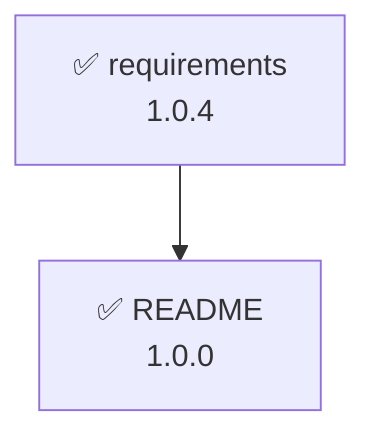

# spectrack (完全版仕様書)

仕様書依存関係追跡ツール

仕様書のフロントマターに記載された依存ドキュメントとバージョンから、依存ドキュメントが更新されているかを追跡・差分を検出するツールです。ファイルの移動やリネームに影響されない堅牢なIDベースの追跡と、Gitのコミット履歴を活用した高度なバージョン管理を提供します。

## 1. 用語定義

このドキュメント内で使用する用語の定義：

* **依存先（ドキュメント）**：参照される側のドキュメント（被参照ドキュメント）
* **依存元（ドキュメント）**：依存先を参照する側のドキュメント（参照ドキュメント）
* **依存関係**：依存元から依存先への方向性を持つ関係
* **Working tree**：Gitにまだコミットされていない、現在手元で編集中のファイル状態

## 2. 設定ファイルと除外設定

### spectrack.yml

ツールのルートディレクトリに配置する主設定ファイルです。

```yaml
frontMatterKeyPrefix: x-st-              # 仕様書のフロントマターに指定するspectrack用の設定値キーのプレフィックス(default: x-st-)
documentRootPath: doc                    # 検索/追跡対象の仕様書ルートパス(default: doc)
frontMatterTemplate:                     # フロントマターに追加するメタデータテンプレート
  md:
    version: 0.0.0
    x-st-version-path: version
    x-st-id: "{{context.file.dir}}-{{nanoid}}"  # ディレクトリ名-nanoidをIDに使用
    x-st-dependencies: []
  yml:
    x-st-version-path: info.version
    x-st-id: "{{context.file.dir}}-{{nanoid}}"
    x-st-dependencies: []
  yaml:
    x-st-version-path: info.version
    x-st-id: "{{context.file.dir}}-{{nanoid}}"
    x-st-dependencies: []

```

### .spectrackignore

検索対象から除外するディレクトリやファイルを定義します。`.gitignore` と同じ文法を使用します。
対象拡張子（`.md`, `.yml`, `.yaml`）のフルパース実行時、ここに記載されたパスはスキップされます（例: `node_modules/`, `drafts/` など）。

## 3. フロントマターメタデータ

`frontMatterKeyPrefix` が `x-st-` の場合の例です。
**【重要】** メタデータの更新時は、AST（抽象構文木）を保持するパーサーを使用し、ユーザーが記述したYAMLのコメント（`#`）やインデントなどの既存フォーマットを維持します（コミットIDはフロントマターには保持しません）。

```yaml
x-st-version-path: version                # 参照するべきドキュメントバージョンのキーまたはパス
x-st-id: prd-V1StGXR8_Z5jdHi6B-myT        # ドキュメントを一意に識別するID（ディレクトリ名-nanoid形式）
x-st-dependencies:                        # 依存先のリスト
  - id: domain-V1StGXR8_Z5jdHi6B-myT      # 依存先ドキュメントのID
    version: 2.0.0                        # 依存先ドキュメントのバージョン
  - id: ubiquitous-V1StGXR8_Z5jdHi6B-myU
    version: 1.0.2
version: 1.0.0                            # ドキュメントのバージョン

```

## 4. コンテキスト情報

対象ファイル操作時に渡されるコンテキスト情報の構造。`frontMatterTemplate` のテンプレート文字列で dotpath 記法により参照可能。

```yaml
context:
  config:                                  # 設定ファイル（spectrack.yml）の内容
    frontMatterKeyPrefix: x-st-            # フロントマターキープレフィックス
    documentRootPath: doc                  # ドキュメントルートパス
    # (frontMatterTemplateの内容が続く...)
  file:
    path: docs/prd/requirements.md         # ファイルの相対パス
    name: requirements                     # 拡張子なしのファイル名
    ext: md                                # ファイル拡張子
    dir: prd                               # 直下のディレクトリ名（documentRootPathに依存しない、単純な親ディレクトリ名）
  frontMatter:
    x-st-id: prd-V1StGXR8_Z5j              # ドキュメントID
    x-st-version-path: version             # バージョンパス指定
    x-st-dependencies:                     # 依存先のリスト
      - id: domain-V1StGXR8_Z5j
        version: 2.0.0
  current:
    version: 1.0.0                         # 現在のバージョン
  lastCommit:
    version: 1.0.0                         # 最後のコミット時のバージョン
    updatedAt: 2024-11-08T14:30:00Z        # 最後のコミット日時
  previous:
    version: 0.9.5                         # 前回のバージョン
    updatedAt: 2024-11-01T09:15:00Z        # 前回の更新日時
  command:
    name: add                              # 実行コマンド名
    args:                                  # コマンド引数（位置引数）
      file: docs/prd/requirements.md       # 対象ファイルのパス
    options:                               # コマンドオプション
      deps: st-prd-001:1.0.0
      depsStructured:
        - id: st-prd-001
          version: 1.0.0
      version: 1.0.1
      strict: true
  macro:
    nanoid: V1StGXR8_Z5jdHi6B-myT          # nanoid生成マクロ（21文字のランダム文字列）

```

## 5. コアの挙動とロジック

### ファイルシステムとパスの解決

* **フルパース方式**: コマンド実行のたびに `documentRootPath` 以下の対象拡張子（`.spectrackignore` を除く）をすべてスキャンし、メモリ上に「IDとファイルパスのマッピング」を構築します。これによりファイルの移動やリネームに強固に対応します。
* **空ファイルの扱い**: 完全に空のファイルであっても対象拡張子であれば処理対象とし、先頭にフロントマターを挿入します。
* **削除ファイルの推定（エラーハンドリング）**: ファイルが削除されてIDからパスを解決できない場合、内部で `git log -S "[id]"` 等を実行し、過去にそのIDが存在したファイルパスを推定してエラーメッセージに提示します。

### バージョン比較のロジック（SemVer準拠）

更新判定は厳密なセマンティックバージョニングに準拠します。

* **更新とみなす変更**: メジャーバージョンまたはマイナーバージョンの更新。
* **0.x.x の扱い**: メジャーバージョンが `0` の場合、マイナーバージョンの更新（例: `0.1.0` → `0.2.0`）を破壊的変更（更新あり）として扱います。パッチ更新（例: `0.1.0` → `0.1.1`）は通常のSemVer解釈に従い、「更新あり」とはみなしません（`--strict` 指定時を除く）。
* **プレリリースバージョン**: `-1` や `-2` など、**数値のみ**のプレリリース表記（例: `1.0.0-1`）を許容します。英字を含む場合はエラーとします。
* **パッチ更新**: パッチバージョンのみの更新（例: `1.0.0` → `1.0.1`）は「更新あり」とみなしません（`--strict` 指定時を除く）。

## 6. コマンド

※ `<file>` は必須の位置引数、`[<file>]` は省略可能な位置引数を示します。
また、各コマンドの出力には、ファイル削除時の追跡手がかりとして**コミットハッシュ（短縮版）**を併記します。

### spectrack add

指定したドキュメントにメタデータを追加する。

* 引数 `<file>` が必須（ドキュメントのパス）
* 新規ドキュメント、または既存ドキュメントにフロントマターを作成
* `--deps` オプションで依存ドキュメントを指定可能（形式：`id:version,id:version,...`）
* 指定されたIDやバージョンが存在しない場合は追加をブロックしエラーとする（前方参照不可）。※循環依存を作りたい場合は、追加後に `update` コマンドで依存関係を結びます。
* 終了コード：0（成功）、1（エラーあり）、2（警告あり）

**コマンド**
`spectrack add <file> [--deps=<id>:<version>,...]`

**コマンド実行例**

```bash
spectrack add docs/prd/requirements.md
spectrack add docs/use-case/UC001.md --deps=st-prd-001:1.0.0,st-domain-001:2.0.0

```

**表示例（`--deps` 指定）**

```console
✅ ドキュメント追加完了
  📄 ファイル: docs/use-case/UC001.md
  🆔 ID: st-uc-001
  📌 バージョン: 0.0.0
  📦 依存ドキュメント: 2 個
    ├─ st-prd-001 (v1.0.0)
    └─ st-domain-001 (v2.0.0)

```

### spectrack update

指定したドキュメントのメタデータを更新する。

* 引数 `<file>` が必須（ドキュメントのパス）
* `--version=<version>`：ドキュメントバージョンを更新
* `--add-deps=<id>[:<version>|auto],...`：依存ドキュメントを追加。**既に存在する依存先IDを指定した場合、重複追加せず指定バージョンで上書き更新する。**指定されたID/バージョンが存在しない場合はエラー。
* `--remove-deps=<id>,...`：依存ドキュメントを削除
* `--upgrade-deps`：依存先ドキュメントのバージョンをすべて最新バージョン（**Gitの最新コミット状態のバージョン**）に更新
* 終了コード：0（成功）、1（エラーあり）、2（警告あり）

**コマンド**
`spectrack update <file> [--version=<version>] [--add-deps=<id>[:<version>],...] [--remove-deps=<id>,...] [--upgrade-deps]`

**コマンド実行例**

```bash
spectrack update docs/prd/requirements.md --version=1.0.1
spectrack update docs/design/01-overall.md --version=1.1.0 --add-deps=st-uc-001:auto --remove-deps=st-prd-002

```

**表示例（複合更新）**

```console
✅ ドキュメント更新完了
  📄 ファイル: docs/design/01-overall.md
  🆔 ID: st-design-001
  📝 更新内容:
    ├─ 📌 バージョン: 1.0.0 → 1.1.0
    ├─ ➕ 依存ドキュメント追加/更新: 1 個
    │  └─ st-uc-001 (auto取得: v2.1.3)
    └─ ➖ 依存ドキュメント削除: 1 個
        └─ st-prd-002

```

### spectrack init

ドキュメントルートパス以下に存在するすべての対象ファイルにメタデータを追加する。

* `--add-frontmatter`：フロントマターにメタデータを追加する。指定がない場合は設定ファイルのみ作成/確認。
* 設定ファイルがない場合はテンプレートを作成。
* 既存のキーは保持し、不足している `x-st-` 系キーのみを挿入する。
* 終了コード：0（成功）、1（エラーあり）、2（警告あり）

**コマンド**
`spectrack init [--add-frontmatter]`

**コマンド実行例と表示例**

```bash
spectrack init --add-frontmatter

⚙️  設定ファイル: spectrack.yml を作成しました
📝 テンプレート設定をコメント状態で記載しました。必要に応じて編集してください。

✅ 初期化完了
  📄 初期化対象ファイル数: 15 個
  ✨ メタデータ追加: 14 個
  ⏭️  スキップ（既に存在）: 1 個
  ❌ エラー: 0 個

```

### spectrack check-deps

ドキュメントの依存先をチェックする。

* **引数なし**：すべてのドキュメントの依存先をチェック
* **`<file>` 指定**：指定ドキュメントに依存しているすべてのドキュメントを検索しチェック
* **評価基準**: 依存元（参照側）は **Working tree（手元の未コミット状態）** を正とし、依存先（被参照側）は **Gitの最新コミット状態** を正として比較する。未コミットの依存先の変更は評価対象外とする。
* 終了コード：0（成功）、1（エラーあり）、2（警告あり - 更新検出または `--strict` 時のパッチ更新検出）

**コマンド**
`spectrack check-deps [<file>] [--strict]`

**コマンド実行例と表示例**

```console
$ spectrack check-deps docs/prd/requirements.md

━━━━━━━━━━━━━━━━━━━━━━━━━━━━━━
📄 [st-uc-001] docs/use-case/UC001.md の依存先:
   └─ 🔄 [st-prd-001] docs/prd/requirements.md (参照: 1.0.0, 現在: 1.1.0 @ 8f9e0d1) ⚠️ 更新あり

```

### spectrack show-deps

ドキュメントの依存先をすべて表示する。

* 依存先のバージョンが参照バージョンと一致している場合は ✅ マーク、更新されている場合は 🔄 マークで表示。
* 対象ファイルの最新コミットハッシュ（短縮版）を併記する。

**コマンド**
`spectrack show-deps [<file>]`

**表示例**

```console
━━━━━━━━━━━━━━━━━━━━━━━━━━━━━━
📄 [st-uc-001] docs/use-case/UC001.md (2.1.3 @ a1b2c3d) の依存先:
   ├─ ✅ [st-prd-001] docs/prd/requirements.md (参照: 1.0.0, 現在: 1.0.0 @ 8f9e0d1)
   └─ 🔄 [st-domain-001] docs/domain/domain-model.md (参照: 2.0.0, 現在: 2.0.1 @ c4d5e6f) ⚠️ 更新あり

```

### spectrack find-dependents

指定したドキュメントを依存先とする依存元ドキュメント（依存しているドキュメント）を検索する。

**コマンド**
`spectrack find-dependents <file>`

**表示例**

```console
🔍 [st-prd-001] docs/prd/requirements.md に依存しているドキュメントを検索中...

  ✅ [st-uc-001] docs/use-case/UC001.md (2.1.3)
      └─ depends on: [st-prd-001] docs/prd/requirements.md (1.0.0)

```

### spectrack verify

すべてのドキュメントの構造と依存関係を検証する。

* 循環依存はデフォルトで警告。`--allow-cycles`で許容可能。
* 終了コード：0（成功）、1（エラーあり）、2（警告あり）

**コマンド**
`spectrack verify [--allow-cycles]`

**表示例**

```console
✅ 検証開始: 18 個のドキュメントを検査中...

━━━━━━━━━━━━━━━━━━━━━━━━━━━━━━
🔍 フロントマター構造: OK (18/18)
🆔 ID一意性: OK (18/18)
📦 参照先確認: OK (18/18)
🔄 循環依存: ⚠️ 警告 (2 個の循環参照検出)
  - [st-uc-001] ← [st-domain-001] ← [st-uc-001]
📌 バージョン形式: OK (18/18)

✅ 検証完了: 警告 1 件

```

### spectrack list-versions

ドキュメントのバージョン情報を表示する。

* コミット履歴から最終更新日とコミットハッシュを取得・表示する。

**コマンド**
`spectrack list-versions [<file>]`

**表示例**

```console
━━━━━━━━━━━━━━━━━━━━━━━━━━━━━━
📄 [st-prd-001] docs/prd/requirements.md
   📌 現在: 1.0.4
   🕐 最終更新: 2024-11-08 (commit: 8f9e0d1)

━━━━━━━━━━━━━━━━━━━━━━━━━━━━━━
📄 [st-uc-001] docs/use-case/UC001.md
   📌 現在: 2.1.3
   🕐 最終更新: 2024-11-07 (commit: a1b2c3d)

```

### spectrack graph

ドキュメントの依存関係グラフを指定形式で生成する。

**コマンド**
`spectrack graph [--format=<format>]`

**表示例（mermaid デフォルト）**



### spectrack diff

指定されたドキュメントの特定バージョンと現在のバージョンの差分を表示する。

* **コミット特定ロジック**: Gitの履歴（`git log`等）をパースし、対象ファイルのフロントマターの `version` 値が指定バージョンに変更された瞬間のコミットハッシュを特定して差分を比較する。

**コマンド**
`spectrack diff <file> --version=<version>`

**表示例**

```console
📝 現在のバージョン: 1.0.4
🔍 比較対象バージョン: 1.0.2
📦 対応するコミット: 58b0950ea2edfb64b591645e4f6caff812897933
📖 差分を表示します...
diff --git a/docs/prd/requirements.md b/docs/prd/requirements.md
index cd29a6d..e19b993 100644
--- a/docs/prd/requirements.md
+++ b/docs/prd/requirements.md
@@ -5 +5 @@ status: "done"
version: [-"1.0.2"-]{+"1.0.4"+}

```

## 7. エラーハンドリング

### 終了コードの定義

* `0`: 成功、エラーなし
* `1`: エラーあり（致命的）
* `2`: 警告あり（処理は完了したが、注意が必要）

### エラー一覧と対応（Git履歴からのパス推定機能追加）

| エラー種別 | 終了コード | エラーメッセージと対応 |
| --- | --- | --- |
| **参照エラー** | 1 | `ERROR: 依存先 [id] が見つかりません。ファイルが削除された可能性があります。（Git履歴の推定元パス: docs/prd/requirements.md）` |
| **バージョン不在** | 1 | `ERROR: ID [id] のバージョン [version] は存在しません` |
| **ID重複** | 1 | `ERROR: ID重複検出。ID [id] が複数のドキュメントで使用されています` |
| **ファイル不在** | 1 | `ERROR: ファイル [path] が見つかりません。ファイルが削除された可能性があります。（Git履歴の推定元パス: docs/prd/requirements.md）` |
| **フロントマター不正** | 1 | `ERROR: [file] のフロントマター形式が不正です` |
| **設定ファイル不在** | 1 | `ERROR: spectrack.yml が見つかりません` |
| **プレリリース不正** | 1 | `ERROR: プレリリースバージョンは数値のみ許可されています (例: 1.0.0-1)` |
| **SemVer不正** | 2 | `WARNING: [file] のバージョン [version] は有効なセマンティックバージョンではありません` |

### Git 連携固有エラー

| エラー種別 | 終了コード | エラーメッセージと対応 |
| --- | --- | --- |
| **差分対象不在** | 1 | `ERROR: バージョン [version] となるコミットがGit履歴から見つかりません` |
| **Git未初期化** | 1 | `ERROR: Git リポジトリが初期化されていません` |
| **Gitコミットゼロ** | 1 | `ERROR: spectrack は Git の履歴を利用するため、少なくとも1つのコミットが必要です。(Internal: [Gitの生エラー出力])` |

## 8. 循環依存の取り扱い

ユースケースとドメインモデルの間など、ドキュメントの性質上、循環依存が発生することは想定されます。

* `spectrack verify` ではデフォルトで循環依存を **警告 (終了コード2)** として検出します。
* `--allow-cycles` オプションを指定することで、循環依存をエラーや警告とせず **許容 (終了コード0)** できます。
* `spectrack check-deps` では循環依存の有無に関わらず、通常通り依存先の更新を正しく検出します。

```
