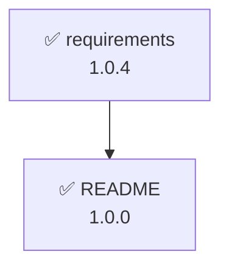

# spectrack v6 (完全版仕様書)

仕様書依存関係追跡ツール

仕様書のフロントマターに記載された依存ドキュメントとバージョンから、依存ドキュメントが更新されているかを追跡・差分を検出するツールです。ファイルの移動やリネームに影響されない堅牢なIDベースの追跡と、Gitのコミット履歴を活用した高度なバージョン管理を提供します。

## 1. 用語定義

このドキュメント内で使用する用語の定義：

* **依存先（ドキュメント）**：参照される側のドキュメント（被参照ドキュメント）
* **依存元（ドキュメント）**：依存先を参照する側のドキュメント（参照ドキュメント）
* **依存関係**：依存元から依存先への方向性を持つ関係
* **Working tree**：Gitにまだコミットされていない、現在手元で編集中のローカルファイル状態

## 2. 設定ファイルと除外設定

### spectrack.yml

ツールのルートディレクトリ（プロジェクトルート）に配置する主設定ファイルです。**このファイルが存在するディレクトリを基点として、配下の全対象ファイルをスキャンします。**

```yaml
frontMatterKeyPrefix: x-st-              # 仕様書のフロントマターに指定するspectrack用の設定値キーのプレフィックス(default: x-st-)
frontMatterTemplate:                     # フロントマターに追加するメタデータテンプレート
  md:
    version: 0.0.0
    x-st-version-path: version
    x-st-id: "{{context.file.dir}}-{{context.utils.nanoid}}"  # ディレクトリ名-nanoidをIDに使用
    x-st-dependencies: []
  yml:
    x-st-version-path: info.version
    x-st-id: "{{context.file.dir}}-{{context.utils.nanoid}}"
    x-st-dependencies: []
  yaml:
    x-st-version-path: info.version
    x-st-id: "{{context.file.dir}}-{{context.utils.nanoid}}"
    x-st-dependencies: []

```

### .spectrackignore

検索対象から除外するディレクトリやファイルを定義します。`.gitignore` と同じ文法を使用します。
対象拡張子（`.md`, `.yml`, `.yaml`）のスキャン時、ここに記載されたパスはスキップされます。

**【重要】初期化時のデフォルト生成**
`init` コマンドで本ファイルが新規作成される際、誤ってソースコードやシステム設定ファイル等を仕様書として巻き込まないよう、以下の「一般的な除外リスト」がデフォルトで書き込まれます。

```text
# 自動生成されたデフォルトの除外設定
node_modules/
.git/
.github/
.vscode/
dist/
build/
src/
README.md
CHANGELOG.md
docker-compose*.yml
.*.yml
.*.yaml

```

## 3. フロントマターメタデータ

`frontMatterKeyPrefix` が `x-st-` の場合の例です。
**【重要】** メタデータの更新時は、AST（抽象構文木）を保持するパーサーを使用し、ユーザーが記述したYAMLのコメント（`#`）やインデントなどの既存フォーマットを維持します（コミットIDはフロントマターには保持しません）。

```yaml
x-st-version-path: version                # 参照するべきドキュメントバージョンのキーまたはパス
x-st-id: prd-V1StGXR8_Z5jdHi6B-myT        # ドキュメントを一意に識別するID（ディレクトリ名-nanoid形式）
x-st-dependencies:                        # 依存先のリスト
  - id: domain-V1StGXR8_Z5jdHi6B-myT      # 依存先ドキュメントのID（追跡における正の情報）
    path: docs/domain/domain-model.md     # パスヒント：人間用の補助情報（ツールが自動更新する）
    version: 2.0.0                        # 依存先ドキュメントのバージョン
  - id: ubiquitous-V1StGXR8_Z5jdHi6B-myU
    path: docs/domain/ubiquitous.md
    version: 1.0.2
version: 1.0.0                            # ドキュメントのバージョン

```

## 4. コンテキスト情報

対象ファイル操作時に渡されるコンテキスト情報の構造。`frontMatterTemplate` のテンプレート文字列で dotpath 記法により参照可能。

```yaml
context:
  config:                                  # 設定ファイル（spectrack.yml）の内容
    frontMatterKeyPrefix: x-st-            # フロントマターキープレフィックス
  file:
    path: docs/prd/requirements.md         # ファイルの相対パス
    name: requirements                     # 拡張子なしのファイル名
    ext: md                                # ファイル拡張子
    dir: prd                               # 直下のディレクトリ名（単純な親ディレクトリ名）
  frontMatter:
    x-st-id: prd-V1StGXR8_Z5j              # ドキュメントID
    x-st-version-path: version             # バージョンパス指定
    x-st-dependencies:                     # 依存先のリスト
      - id: domain-V1StGXR8_Z5j
        path: docs/domain/domain-model.md
        version: 2.0.0
  current:
    version: 1.0.0                         # 現在のバージョン
  lastCommit:
    version: 1.0.0                         # 最後のコミット時のバージョン
    updatedAt: 2024-11-08T14:30:00Z        # 最後のコミット日時
  previous:
    version: 0.9.5                         # 前回のバージョン
    updatedAt: 2024-11-01T09:15:00Z        # 前回の更新日時
  command:
    name: link                             # 実行コマンド名
    args:                                  # コマンド引数
      file: docs/prd/requirements.md       # 対象ファイルのパス
    options:                               # コマンドオプション
      deps: docs/use-case/UC001.md
      dryRun: false
  utils:
    nanoid: V1StGXR8_Z5jdHi6B-myT          # nanoid生成ユーティリティ（21文字のランダム文字列）

```

## 5. コアの挙動とロジック

### 【重要】評価データソースの原則（Working Tree ファースト）

履歴を遡る一部のコマンド（`log`, `diff`, `deps-diff` 等）を除き、すべてのドキュメントのパース・依存関係の解決・バージョン比較は**「Working Tree（手元の未コミット状態）」**を正として行います。
これにより、「仕様書Aを更新（未コミット）」→「それに伴い仕様書Bも更新して依存バージョンを同期（未コミット）」→「整合性が取れた状態でAとBを同時にコミット」という自然な開発体験（アトミック・コミット）を実現します。

### ファイルシステムとパスの解決

* **フルパース方式**: コマンド実行のたびに **`spectrack.yml` が存在するディレクトリを起点とし、**配下の対象拡張子（`.spectrackignore` を除く）をすべてスキャンし、メモリ上に「IDとファイルパスのマッピング」を構築します。
* **空ファイルの扱い**: 完全に空のファイルであっても対象拡張子であれば処理対象とし、先頭にフロントマターを挿入します。
* **削除ファイルの推定（Git連携）**: ファイルが削除されてIDからパスを解決できない場合、内部で `git log -S "[id]"` 等を実行し、過去にそのIDが存在したファイルパスを推定してエラーに提示します。
* **ファイルパスによる自動ID解決**: ユーザーがCLIで依存先を指定する際、IDの代わりに**ファイルパス**（相対・絶対）を指定可能です。ツール内部で指定ファイルのフロントマターを読み込み、自動的にIDへと変換して紐付けます。
* **パスヒント（Path Hint）の自動更新**: メタデータを更新するコマンド（`link`, `sync` 等）が実行されるたび、依存先IDに紐づく最新のファイルパスを `path` キーとして自動で書き込みます。**追跡の正はあくまで `id` であり、`path` は人間が読むためのRead-Onlyな補助情報です（このパスがリンク切れしていても追跡エラーにはしません）。**

### バージョン比較のロジック（SemVer準拠）

更新判定は厳密なセマンティックバージョニングに準拠します。

* **更新とみなす変更**: メジャーバージョンまたはマイナーバージョンの更新。
* **0.x.x の扱い**: メジャーバージョンが `0` の場合、マイナーバージョンの更新（例: `0.1.0` → `0.2.0`）を破壊的変更（更新あり）として扱います。
* **プレリリースバージョン**: `-1` や `-2` など、**数値のみ**のプレリリース表記（例: `1.0.0-1`）を許容します。英字を含む場合はエラーとします。
* **パッチ更新**: パッチバージョンのみの更新（例: `1.0.0` → `1.0.1`）は「更新あり」とみなしません（`--strict` 指定時を除く）。

## 6. コマンド体系

※ `<file>` は必須の位置引数、`[<file>]` は省略可能な位置引数を示します。
また、各コマンドの出力には、ファイル削除時の追跡手がかりとして**コミットハッシュ（短縮版）**を併記します（未コミットの場合は Working tree と表記）。

**共通オプション (`--dry-run`)**:
ファイルを変更・保存するすべてのコマンド（`init`, `link`, `unlink`, `bump`, `sync`）において、`--dry-run` オプションを指定可能です。これを指定した場合、実際のファイル書き換えは行わず、「どのファイルのフロントマターがどのように変更される予定か」の差分のみを標準出力に表示します。

---

### spectrack init

プロジェクト全体の初期化、または指定したファイルの初期化（フロントマターの追加・追跡開始）を行う。
設定ファイル（`spectrack.yml` や `.spectrackignore`）が存在しない場合は、どの引数・オプションであっても自動生成する。

* **引数なし**: プロジェクトの初期化（設定ファイルの作成）のみを行う。
* **`<file>...`**: 指定したファイル（複数可）にフロントマターを追加し、追跡対象にする。単一ファイルの操作のため確認プロンプトは表示されない。
* **`--all`**: プロジェクト内のすべての対象ファイルにフロントマターを一括で追加する。
* **※安全装置**: このオプションを実行すると、対象となるファイル数をカウントし `「45 個のファイルにメタデータを追加します。よろしいですか？ [y/N]」` という確認プロンプトが表示される。
* **`-y, --yes` オプション**: `--all` 指定時のみ使用可能。確認プロンプトをスキップし、自動的に `yes` として処理を続行する（CI環境等で有用）。


**コマンド**
`spectrack init [<file>...] [--all] [--dry-run] [-y, --yes]`

**実行例と表示例 (`--all` 実行時)**

```bash
spectrack init --all

```

```console
⚙️  設定ファイル (spectrack.yml, .spectrackignore) を作成しました

⚠️ 45 個のファイルにメタデータを一括追加します。よろしいですか？ [y/N]: y

✨ 以下のファイルを追跡対象として初期化しました:
  📄 docs/prd/new-feature.md (ID: st-prd-V1StG)
  📄 docs/domain/new-concept.md (ID: st-domain-XR8_Z)
  ... (他 43 件)

```

---

### spectrack link / unlink

ファイル間の依存関係を結ぶ（または解除する）。対象ファイルにフロントマターが存在しない場合はエラーとなるため、事前に `init` コマンドで初期化しておく必要がある。

* **`--deps=<path>[:<version>],...`**: 依存先をカンマ区切りのファイルパスで指定する。
* `:<version>` を付与してバージョンを明示することも可能。省略時は、現在の依存先のWorking treeバージョンを自動取得する。


**コマンド**
`spectrack link <file> --deps=<path>[:<version>],... [--dry-run]`
`spectrack unlink <file> --deps=<path>,... [--dry-run]`

**実行例と表示例**

```bash
spectrack link docs/use-case/UC001.md --deps=docs/prd/requirements.md,docs/domain/domain-model.md:2.0.0

```

```console
🔗 依存関係をリンクしました
  📄 対象ファイル: docs/use-case/UC001.md
  🆔 ID: st-uc-001
  📦 依存ドキュメント追加: 2 個
    ├─ ➕ st-prd-001 (docs/prd/requirements.md: v1.0.0 / 自動取得)
    └─ ➕ st-domain-001 (docs/domain/domain-model.md: v2.0.0)

```

---

### spectrack bump

ドキュメントのバージョンをセマンティックバージョニングに従って自動で引き上げる。

* `--major`, `--minor`, `--patch` のいずれかを指定する。

**コマンド**
`spectrack bump <file> [--major|--minor|--patch] [--dry-run]`

**実行例と表示例**

```bash
spectrack bump docs/prd/requirements.md --minor

```

```console
⬆️ バージョン更新完了
  📄 ファイル: docs/prd/requirements.md
  📌 バージョン: 1.2.3 → 1.3.0

```

---

### spectrack sync

依存先ドキュメントが更新されていた場合、「変更内容を確認して自身のドキュメントも追従した」ことをマークする。

* 自身のフロントマター内の依存バージョン指定を、依存先の**Working Tree上の最新バージョン**で上書き更新する。
* 同時に `path` ヒントも最新パスに更新される。
* 特定の依存先だけを同期したい場合は `--only=<path_or_id>,...` で指定可能。

**コマンド**
`spectrack sync <file> [--only=<path_or_id>,...] [--dry-run]`

**実行例と表示例**

```bash
spectrack sync docs/use-case/UC001.md

```

```console
🔄 依存バージョンの同期完了
  📄 ファイル: docs/use-case/UC001.md
  ✅ 以下の依存ドキュメントを最新状態に更新しました:
    └─ st-prd-001 (docs/prd/requirements.md): 1.0.0 → 1.1.0

```

---

### spectrack status

ドキュメントの依存先ツリーを表示し、依存先のバージョンが更新されていれば警告を出す。

* 引数なしの場合はプロジェクト全体の依存状況をチェックする。
* 依存元と依存先の両方を**Working tree（未コミット状態）を正として比較**する。
* 終了コード：0（成功）、1（エラーあり）、2（警告あり - 更新検出）

**コマンド**
`spectrack status [<file>] [--strict]`

**実行例と表示例**

```console
$ spectrack status docs/use-case/UC001.md

━━━━━━━━━━━━━━━━━━━━━━━━━━━━━━
📄 [st-uc-001] docs/use-case/UC001.md (2.1.3 @ Working tree) の依存状況:
   ├─ ✅ [st-prd-001] docs/prd/requirements.md (参照: 1.0.0, 現在: 1.0.0 @ 8f9e0d1)
   └─ 🔄 [st-domain-001] docs/domain/domain-model.md (参照: 2.0.0, 現在: 2.1.0 @ Working tree) ⚠️ 更新あり

```

---

### spectrack diff

指定したドキュメント自身の、過去のバージョンと現在のWorking Treeとの差分を表示する。

* `--version=<version>` で比較対象の過去バージョンを指定する。省略時は直前のバージョンを自動取得する。
* `--context=<lines>` または `--full` で、表示するコンテキスト（周辺行）の範囲を制御可能（デフォルトはGitと同じ3行）。

**コマンド**
`spectrack diff <file> [--version=<version>] [--full | --context=<lines>]`

**実行例（`--full` 指定時: ファイル全体と差分を表示）**

```console
$ spectrack diff docs/prd/requirements.md --version=1.0.2 --full

🔍 docs/prd/requirements.md の差分を表示します (v1.0.2 vs Working Tree)
━━━━━━━━━━━━━━━━━━━━━━━━━━━━━━
  # ユーザー要件定義書
  
  ## ログイン機能
  - ユーザーはメールアドレスでログインできること
+ - ユーザーはGoogleアカウントでSSOログインできること（追加）
  - パスワードを忘れた場合はリセットリンクを送信できること
  
  ## ダッシュボード機能
- - ログイン直後は統計データが表示されること
+ - ログイン直後は個人のタスク一覧が表示されること（仕様変更）
  - ...

```

**実行例（`--context=1` 指定時: 変更箇所の前後1行のみ表示）**

```console
$ spectrack diff docs/prd/requirements.md --version=1.0.2 --context=1

🔍 docs/prd/requirements.md の差分を表示します (v1.0.2 vs Working Tree)
━━━━━━━━━━━━━━━━━━━━━━━━━━━━━━
@@ -16,3 +16,4 @@
  - ユーザーはメールアドレスでログインできること
+ - ユーザーはGoogleアカウントでSSOログインできること（追加）
  - パスワードを忘れた場合はリセットリンクを送信できること

```

---

### spectrack deps-diff

対象ドキュメントが依存しているすべてのドキュメントの差分を表示する。
`status` で更新が検出された後、具体的にどこが変わったのかを確認するためのコマンド。

* 対象ドキュメントのフロントマターに記載されている「参照バージョン」になった瞬間のGitコミットを特定し、その時点と「現在のWorking Tree」との差分を出力する。
* 参照バージョンと現在のバージョンが同じ場合はスキップされる。
* 本コマンドでも `diff` コマンド同様に `--full` や `--context=<lines>` オプションが利用可能。

**コマンド**
`spectrack deps-diff <file> [--full | --context=<lines>]`

**実行例と表示例**

```console
$ spectrack deps-diff docs/use-case/UC001.md

🔍 依存先ドキュメントの変更内容を表示します...

━━━━━━━━━━━━━━━━━━━━━━━━━━━━━━
📄 [st-prd-001] docs/prd/requirements.md (参照: 1.0.0 → 現在: 1.1.0)
📦 比較対象: 58b0950 (v1.0.0) vs Working Tree
━━━━━━━━━━━━━━━━━━━━━━━━━━━━━━
diff --git a/docs/prd/requirements.md b/docs/prd/requirements.md
--- a/docs/prd/requirements.md
+++ b/docs/prd/requirements.md
@@ -15,2 +15,3 @@
 - ユーザーはメールアドレスでログインできること
+- ユーザーはGoogleアカウントでSSOログインできること（追加）

```

---

### spectrack list

プロジェクト内の全追跡対象ドキュメントのインベントリ（目録）を表示する。

* 出力項目: ファイルパス、ID、現在のバージョン、最終更新日。
* **Git非依存（フォールバック）対応**: Gitリポジトリが未初期化の場合、またはファイルが未コミットの場合は、Gitのコミット日時の代わりに**OSのファイルシステム上の最終更新日時（mtime）**を取得し、`(Git未管理)` 等のステータスとともに表示する。これにより、Git環境がなくても動作可能とする。

**コマンド**
`spectrack list`

**実行例と表示例**

```console
━━━━━━━━━━━━━━━━━━━━━━━━━━━━━━
📦 ドキュメント一覧 (全 18 ファイル)

📄 docs/prd/requirements.md [st-prd-001]
   📌 バージョン: 1.0.4 (未コミットの変更あり)
   🕐 最終コミット: 2024-11-08 (8f9e0d1)

📄 docs/design/new-ui.md [st-design-005]
   📌 バージョン: 0.1.0
   🕐 最終更新: 2024-11-09 (Git未管理・OSタイムスタンプ)

```

---

### spectrack dependents

指定したドキュメントに「依存している」ドキュメント（逆引き）を検索する。
仕様変更時の影響範囲の特定に使用する。

**コマンド**
`spectrack dependents <file>`

**実行例と表示例**

```console
🔍 [st-prd-001] docs/prd/requirements.md に依存しているドキュメントを検索中...

  ✅ [st-uc-001] docs/use-case/UC001.md (2.1.3)
      └─ depends on: [st-prd-001] docs/prd/requirements.md (1.0.0)

```

---

### spectrack log

指定ドキュメントのバージョン変更履歴を表示する。

* Gitの履歴（`git log`等）をパースし、フロントマターの `version` 値が変更された瞬間のコミットハッシュと日時を特定してタイムラインとして出力する。これのみGitコミット履歴を正として動作する。

**コマンド**
`spectrack log <file>`

**実行例と表示例**

```console
$ spectrack log docs/prd/requirements.md

🕒 バージョン履歴: docs/prd/requirements.md
━━━━━━━━━━━━━━━━━━━━━━━━━━━━━━
✨ 1.0.4  2024-11-08 14:30:00 (commit: 58b0950)
📝 1.0.3  2024-11-05 10:15:00 (commit: a1b2c3d)
📝 1.0.0  2024-10-20 09:00:00 (commit: e9f8d7c)

```

---

### spectrack verify

すべてのドキュメントの構造と依存関係を検証する。（CIでの実行を想定）

* 循環依存はデフォルトで警告。`--allow-cycles`で許容可能。
* 終了コード：0（成功）、1（エラーあり）、2（警告あり）

**コマンド**
`spectrack verify [--allow-cycles]`

**表示例**

```console
✅ 検証開始: 18 個のドキュメントを検査中...

━━━━━━━━━━━━━━━━━━━━━━━━━━━━━━
🔍 フロントマター構造: OK (18/18)
🆔 ID一意性: OK (18/18)
📦 参照先解決: OK (18/18)
🔄 循環依存: ⚠️ 警告 (2 個の循環参照検出)
  - [st-uc-001] ← [st-domain-001] ← [st-uc-001]
📌 バージョン形式: OK (18/18)

✅ 検証完了: 警告 1 件

```

---

### spectrack graph

ドキュメントの依存関係グラフを指定形式で生成する。

**コマンド**
`spectrack graph [--format=<format>]`

**表示例（mermaid デフォルト）**



## 7. エラーハンドリング

### 終了コードの定義

* `0`: 成功、エラーなし
* `1`: エラーあり（致命的）
* `2`: 警告あり（処理は完了したが、注意が必要）

### エラー一覧と対応（Git履歴からのパス推定機能含む）

| エラー種別 | 終了コード | エラーメッセージと対応 |
| --- | --- | --- |
| **参照エラー** | 1 | `ERROR: 依存先 [id] が見つかりません。ファイルが削除された可能性があります。（Git履歴の推定元パス: docs/prd/requirements.md）` |
| **バージョン不在** | 1 | `ERROR: 依存先ドキュメントは存在しますが、指定されたバージョン [version] と現在のバージョン [current_version] が一致しません` |
| **ID重複** | 1 | `ERROR: ID重複検出。ID [id] が複数のドキュメントで使用されています` |
| **ファイル不在** | 1 | `ERROR: ファイル [path] が見つかりません。ファイルが削除された可能性があります。（Git履歴の推定元パス: docs/prd/requirements.md）` |
| **フロントマター不正** | 1 | `ERROR: [file] のフロントマター形式が不正です` |
| **設定ファイル不在** | 1 | `ERROR: spectrack.yml が見つかりません。spectrack init を実行してください` |
| **プレリリース不正** | 1 | `ERROR: プレリリースバージョンは数値のみ許可されています (例: 1.0.0-1)` |
| **Git未初期化** | 1 | `ERROR: Git リポジトリが初期化されていません` ※`diff`, `deps-diff`, `log` コマンド等でGit履歴が必要な場合のみ発生。`list` 等ではフォールバックが働くため発生しない。 |
| **Gitコミットゼロ** | 1 | `ERROR: spectrack は Git の履歴を利用するため、少なくとも1つのコミットが必要です。(Internal: [Gitの生エラー出力])` |
| **SemVer不正** | 2 | `WARNING: [file] のバージョン [version] は有効なセマンティックバージョンではありません` |

*(※ フロントマター内の `path` キーの欠損やリンク切れはエラーにせず、あくまで `id` の解決可否のみで判定します)*

## 8. 循環依存の取り扱い

ユースケースとドメインモデルの間など、ドキュメントの性質上、循環依存が発生することは想定されます。

* `spectrack verify` ではデフォルトで循環依存を **警告 (終了コード2)** として検出します。
* `--allow-cycles` オプションを指定することで、循環依存をエラーや警告とせず **許容 (終了コード0)** できます。
* `spectrack status` では循環依存の有無に関わらず、通常通り依存先の更新を正しく検出します。
